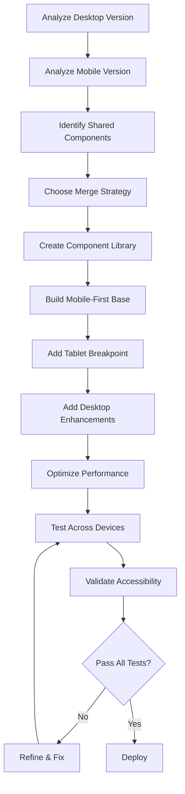

# Responsive Website Merger

## Desktop + Mobile Version Integration for Modern Web Experiences

---

## 🎯 **Skill Overview**

This skill enables an AI agent to intelligently merge desktop and mobile website versions into a unified, modern responsive design that adapts seamlessly across all devices. The skill leverages 2025 web design standards, fluid layouts, and content-driven breakpoints to create experiences that feel native on every screen.

---

## 📊 **Core Data & Modern Standards (2025)**

### **Key Statistics**

- **Mobile Traffic:** Over 60% of global web traffic comes from mobile devices
- **User Expectations:** 73% of web designers report non-responsive design as the #1 reason visitors leave websites
- **SEO Impact:** Google's mobile-first indexing prioritizes mobile-friendly sites for ranking
- **Performance Threshold:** Users expect page loads under 3 seconds across all devices

### **Standard Breakpoints (2025)**

```css
/* Modern Responsive Breakpoints */
320px   - Small Mobile (iPhone SE, older devices)
375px   - Standard Mobile (iPhone 12/13/14)
480px   - Large Mobile / Small Phablets
640px   - Large Phones Landscape / Small Tablets Portrait
768px   - Tablets Portrait (iPad)
1024px  - Tablets Landscape / Small Laptops
1280px  - Desktop / Laptops
1440px  - Large Desktop
1920px  - Full HD Displays
2560px+ - 4K / Ultra-wide Monitors
```

---

## 🔧 **Skill Components**

### **1. Analysis Phase**

**Objective:** Understand both versions and identify merge opportunities

#### **Desktop Version Analysis**

- **Layout Structure:** Multi-column grids, sidebars, expansive navigation
- **Content Density:** Higher information density, more visual elements
- **Interaction Model:** Hover states, mouse-driven interactions, keyboard navigation
- **Navigation Pattern:** Horizontal menus, mega-menus, breadcrumbs
- **Media Strategy:** High-resolution images, video backgrounds, parallax effects

#### **Mobile Version Analysis**

- **Layout Structure:** Single-column, stacked content, hamburger menus
- **Content Density:** Prioritized essential content, progressive disclosure
- **Interaction Model:** Touch-friendly, tap targets 44-48px minimum
- **Navigation Pattern:** Drawer menus, bottom navigation, floating action buttons
- **Media Strategy:** Optimized images, lazy loading, reduced animations

#### **Content Inventory**

```javascript
{
  "shared_elements": [
    "logo", "primary_navigation", "hero_section",
    "product_cards", "testimonials", "footer"
  ],
  "desktop_only": [
    "sidebar_widgets", "hover_tooltips", "mega_menu"
  ],
  "mobile_only": [
    "swipe_gestures", "bottom_nav_bar", "pull_to_refresh"
  ],
  "requires_adaptation": [
    "data_tables", "complex_forms", "image_galleries"
  ]
}
```

---

### **2. Strategy Selection**

**Choose the optimal merge approach based on project needs:**

#### **A. Mobile-First Progressive Enhancement** ⭐ **RECOMMENDED**

```
Mobile (320px) → Tablet (768px) → Desktop (1280px+)
```

**Best For:**

- Content-heavy sites (blogs, news, documentation)
- E-commerce platforms
- SaaS applications
- Projects prioritizing performance and accessibility

**Implementation:**

```css
/* Start with mobile base styles */
.container {
  width: 100%;
  padding: 1rem;
}

/* Enhance for tablets */
@media (min-width: 768px) {
  .container {
    padding: 2rem;
    max-width: 720px;
    margin: 0 auto;
  }
}

/* Full desktop experience */
@media (min-width: 1280px) {
  .container {
    max-width: 1200px;
    display: grid;
    grid-template-columns: 250px 1fr;
    gap: 2rem;
  }
}
```

#### **B. Container Query Approach** 🔥 **CUTTING EDGE**

```
Component-based responsiveness independent of viewport
```

**Best For:**

- Design systems and component libraries
- Complex multi-section layouts
- Reusable UI components
- Micro-frontends

**Implementation:**

```css
.card-container {
  container-type: inline-size;
  container-name: card;
}

@container card (min-width: 400px) {
  .card {
    display: grid;
    grid-template-columns: 1fr 2fr;
    gap: 1rem;
  }
}
```

#### **C. Fluid Hybrid System** 💧

```
Combines fluid typography, spacing, and layout
```

**Implementation:**

```css
/* Fluid typography using clamp() */
h1 {
  font-size: clamp(1.5rem, 4vw + 1rem, 3rem);
}

/* Fluid spacing */
.section {
  padding: clamp(2rem, 5vw, 5rem) clamp(1rem, 3vw, 3rem);
}

/* Fluid grid */
.grid {
  display: grid;
  grid-template-columns: repeat(auto-fit, minmax(min(250px, 100%), 1fr));
  gap: clamp(1rem, 2vw, 2rem);
}
```

---

### **3. Component Merge Patterns**

#### **Pattern 1: Navigation Systems**

**Desktop:** Horizontal mega-menu with dropdowns  
**Mobile:** Hamburger menu with slide-out drawer

**Merged Solution:**

```html
<nav class="primary-nav">
  <!-- Mobile toggle -->
  <button class="nav-toggle" aria-label="Toggle navigation">
    <span class="hamburger"></span>
  </button>

  <!-- Adaptive navigation -->
  <ul class="nav-list">
    <li class="nav-item">
      <a href="#" class="nav-link">Products</a>
      <!-- Adaptive submenu -->
      <div class="submenu">
        <!-- Desktop: Mega-menu grid -->
        <!-- Mobile: Accordion list -->
      </div>
    </li>
  </ul>
</nav>
```

```css
/* Mobile-first base */
.nav-toggle {
  display: block;
}
.nav-list {
  position: fixed;
  left: -100%;
  transition: left 0.3s ease;
}
.nav-list.active {
  left: 0;
}

/* Tablet+ transition */
@media (min-width: 768px) {
  .nav-toggle {
    display: none;
  }
  .nav-list {
    position: static;
    display: flex;
    gap: 2rem;
  }
}
```

#### **Pattern 2: Content Cards**

**Desktop:** Multi-column grid with hover effects  
**Mobile:** Single-column stack with tap-friendly areas

**Merged Solution:**

```css
.card-grid {
  display: grid;
  gap: clamp(1rem, 2vw, 2rem);
  grid-template-columns: repeat(auto-fit, minmax(280px, 1fr));
}

.card {
  position: relative;
  border-radius: 8px;
  overflow: hidden;
  transition: transform 0.2s ease;
}

/* Touch-friendly on mobile */
.card {
  min-height: 120px;
  padding: 1.5rem;
}

/* Enhanced desktop interactions */
@media (hover: hover) {
  .card:hover {
    transform: translateY(-4px);
    box-shadow: 0 12px 24px rgba(0, 0, 0, 0.15);
  }
}
```

#### **Pattern 3: Data Tables**

**Desktop:** Full spreadsheet-style table  
**Mobile:** Card-based representation

**Merged Solution:**

```html
<div class="responsive-table">
  <table class="data-table">
    <thead>
      <tr>
        <th>Product</th>
        <th>Price</th>
        <th>Stock</th>
        <th>Actions</th>
      </tr>
    </thead>
    <tbody>
      <tr data-label-product="Product" data-label-price="Price">
        <td>Widget A</td>
        <td>$29.99</td>
        <td>In Stock</td>
        <td><button>Buy</button></td>
      </tr>
    </tbody>
  </table>
</div>
```

```css
/* Mobile: Cards */
@media (max-width: 767px) {
  .data-table thead {
    display: none;
  }
  .data-table tr {
    display: block;
    margin-bottom: 1rem;
    border: 1px solid #ddd;
    border-radius: 8px;
    padding: 1rem;
  }
  .data-table td {
    display: flex;
    justify-content: space-between;
    padding: 0.5rem 0;
  }
  .data-table td::before {
    content: attr(data-label-product);
    font-weight: bold;
  }
}

/* Desktop: Traditional table */
@media (min-width: 768px) {
  .data-table {
    width: 100%;
    border-collapse: collapse;
  }
  .data-table th,
  .data-table td {
    padding: 1rem;
    text-align: left;
    border-bottom: 1px solid #ddd;
  }
}
```

#### **Pattern 4: Image Galleries**

**Merged Solution with Responsive Images:**

```html
<picture class="responsive-image">
  <source
    media="(min-width: 1280px)"
    srcset="hero-desktop-2x.webp 2x, hero-desktop.webp 1x"
  />
  <source
    media="(min-width: 768px)"
    srcset="hero-tablet-2x.webp 2x, hero-tablet.webp 1x"
  />
  
</picture>
```

---

### **4. Modern CSS Features Integration**

#### **Fluid Typography System**

```css
:root {
  /* Scale between 320px and 1920px viewport */
  --font-size-sm: clamp(0.875rem, 0.8rem + 0.3vw, 1rem);
  --font-size-base: clamp(1rem, 0.9rem + 0.5vw, 1.125rem);
  --font-size-lg: clamp(1.25rem, 1.1rem + 0.7vw, 1.5rem);
  --font-size-xl: clamp(1.75rem, 1.4rem + 1.5vw, 2.5rem);
  --font-size-2xl: clamp(2.5rem, 2rem + 2.5vw, 4rem);

  /* Fluid spacing */
  --space-xs: clamp(0.5rem, 0.4rem + 0.5vw, 0.75rem);
  --space-sm: clamp(1rem, 0.8rem + 1vw, 1.5rem);
  --space-md: clamp(1.5rem, 1.2rem + 1.5vw, 2.5rem);
  --space-lg: clamp(2rem, 1.5rem + 2.5vw, 4rem);
  --space-xl: clamp(3rem, 2rem + 5vw, 6rem);
}
```

#### **CSS Grid with Auto-Fit**

```css
.adaptive-grid {
  display: grid;
  grid-template-columns: repeat(auto-fit, minmax(min(280px, 100%), 1fr));
  gap: var(--space-md);
}
```

#### **Modern Flexbox Patterns**

```css
.flex-container {
  display: flex;
  flex-wrap: wrap;
  gap: var(--space-sm);
  justify-content: space-between;
}

.flex-item {
  flex: 1 1 min(300px, 100%);
}
```

---

### **5. Performance Optimization**

#### **Image Optimization Strategy**

```javascript
// Lazy loading with Intersection Observer
const imageObserver = new IntersectionObserver(
  (entries, observer) => {
    entries.forEach((entry) => {
      if (entry.isIntersecting) {
        const img = entry.target;
        img.src = img.dataset.src;
        img.classList.add("loaded");
        observer.unobserve(img);
      }
    });
  },
  { rootMargin: "50px" },
);

document
  .querySelectorAll("img[data-src]")
  .forEach((img) => imageObserver.observe(img));
```

#### **Critical CSS Extraction**

```html
<head>
  <!-- Inline critical CSS for above-the-fold content -->
  <style>
    /* Mobile-first critical styles */
    body {
      margin: 0;
      font-family:
        system-ui,
        -apple-system,
        sans-serif;
    }
    .hero {
      min-height: 60vh;
      background: linear-gradient(...);
    }
    .nav {
      position: sticky;
      top: 0;
      z-index: 100;
    }
  </style>

  <!-- Defer non-critical CSS -->
  <link
    rel="preload"
    href="styles.css"
    as="style"
    onload="this.onload=null;this.rel='stylesheet'"
  />
</head>
```

#### **Conditional Loading**

```javascript
// Load desktop-specific features only on larger screens
if (window.matchMedia("(min-width: 1024px)").matches) {
  import("./desktop-features.js").then((module) => {
    module.initParallax();
    module.initHoverEffects();
  });
}
```

---

### **6. Accessibility Integration**

#### **Touch Target Sizing**

```css
/* Minimum 44x44px touch targets (WCAG 2.1) */
button,
a,
input[type="checkbox"],
input[type="radio"] {
  min-width: 44px;
  min-height: 44px;
  padding: 0.75rem 1.5rem;
}

/* Spacing between touch targets */
.touch-nav a {
  margin: 0.5rem;
}
```

#### **Focus Management**

```css
/* Visible focus indicators */
:focus-visible {
  outline: 3px solid #4a90e2;
  outline-offset: 2px;
}

/* Skip to main content link */
.skip-link {
  position: absolute;
  top: -40px;
  left: 0;
  z-index: 1000;
  padding: 8px;
  background: #000;
  color: #fff;
}

.skip-link:focus {
  top: 0;
}
```

#### **ARIA Patterns**

```html
<!-- Responsive navigation with proper ARIA -->
<nav aria-label="Primary navigation">
  <button
    class="nav-toggle"
    aria-expanded="false"
    aria-controls="primary-menu"
    aria-label="Toggle navigation menu"
  >
    <span class="sr-only">Menu</span>
    <span class="hamburger" aria-hidden="true"></span>
  </button>

  <ul id="primary-menu" class="nav-list" hidden>
    <li><a href="#home">Home</a></li>
    <li><a href="#about">About</a></li>
  </ul>
</nav>
```

---

### **7. Testing & Validation Checklist**

#### **Device Testing Matrix**

```
✓ iPhone SE (375×667) - Small mobile
✓ iPhone 14 Pro (393×852) - Standard mobile
✓ Samsung Galaxy S21 (360×800) - Android mobile
✓ iPad Mini (744×1133) - Small tablet
✓ iPad Pro (1024×1366) - Large tablet
✓ MacBook Air (1440×900) - Laptop
✓ Desktop 1080p (1920×1080) - Standard desktop
✓ Desktop 4K (3840×2160) - High-res desktop
```

#### **Orientation Testing**

- Portrait mode on all devices
- Landscape mode on mobile/tablet
- Window resizing on desktop

#### **Performance Benchmarks**

```javascript
// Target metrics (Google Core Web Vitals)
const targets = {
  LCP: 2.5, // Largest Contentful Paint (seconds)
  FID: 100, // First Input Delay (milliseconds)
  CLS: 0.1, // Cumulative Layout Shift (score)
};
```

#### **Browser Compatibility**

- Chrome/Edge (latest 2 versions)
- Firefox (latest 2 versions)
- Safari (latest 2 versions)
- Samsung Internet (Android)

---

### **8. Implementation Workflow**



---

## 🚀 **Advanced Techniques**

### **Dark Mode Integration**

```css
:root {
  --bg-primary: #ffffff;
  --text-primary: #1a1a1a;
  --accent: #4a90e2;
}

@media (prefers-color-scheme: dark) {
  :root {
    --bg-primary: #1a1a1a;
    --text-primary: #f5f5f5;
    --accent: #64b5f6;
  }
}

/* Manual toggle support */
[data-theme="dark"] {
  --bg-primary: #1a1a1a;
  --text-primary: #f5f5f5;
}
```

### **Reduced Motion Support**

```css
@media (prefers-reduced-motion: reduce) {
  * {
    animation-duration: 0.01ms !important;
    animation-iteration-count: 1 !important;
    transition-duration: 0.01ms !important;
  }
}
```

### **Print Stylesheet**

```css
@media print {
  .nav,
  .sidebar,
  .footer,
  .ads {
    display: none;
  }

  body {
    font-size: 12pt;
    color: #000;
    background: #fff;
  }

  a::after {
    content: " (" attr(href) ")";
  }
}
```

---

## 📈 **Success Metrics**

**Track these KPIs to measure merge success:**

1. **Performance Metrics**
   - Page load time < 3s
   - Time to Interactive < 5s
   - Core Web Vitals passing

2. **User Engagement**
   - Bounce rate decrease
   - Session duration increase
   - Pages per session increase

3. **Conversion Metrics**
   - Mobile conversion rate vs desktop
   - Form completion rate
   - Cart abandonment rate

4. **Technical Metrics**
   - Lighthouse score > 90
   - WCAG 2.1 AA compliance
   - Cross-browser compatibility 98%+

---

## 🎨 **Modern Design Trends to Incorporate**

1. **Glassmorphism**

```css
.glass-card {
  background: rgba(255, 255, 255, 0.1);
  backdrop-filter: blur(10px);
  border: 1px solid rgba(255, 255, 255, 0.2);
  border-radius: 16px;
}
```

2. **Smooth Scroll Animations**

```css
.animate-on-scroll {
  opacity: 0;
  transform: translateY(30px);
  transition:
    opacity 0.6s ease,
    transform 0.6s ease;
}

.animate-on-scroll.visible {
  opacity: 1;
  transform: translateY(0);
}
```

3. **Micro-interactions**

```css
.button {
  transition: all 0.3s cubic-bezier(0.4, 0, 0.2, 1);
}

.button:active {
  transform: scale(0.95);
}

.button:hover {
  box-shadow: 0 8px 16px rgba(0, 0, 0, 0.2);
}
```

---

## 🛠️ **Recommended Tools & Frameworks**

**CSS Frameworks:**

- Tailwind CSS (utility-first, highly customizable)
- Bootstrap 5+ (rapid prototyping)
- Foundation (accessibility-focused)

**Testing Tools:**

- BrowserStack (cross-browser testing)
- Google Lighthouse (performance auditing)
- Chrome DevTools (responsive testing)
- WAVE (accessibility evaluation)

**Design Tools:**

- Figma (collaborative design with auto-layout)
- Adobe XD (responsive artboards)
- Framer (interactive prototypes)

---

## 💡 **Best Practices Summary**

1. **Always start mobile-first** - It's 2025 standard and improves performance
2. **Use relative units** - em, rem, %, vw/vh for flexibility
3. **Implement lazy loading** - Defer off-screen content
4. **Test on real devices** - Simulators miss real-world issues
5. **Optimize images** - Use WebP, srcset, and proper sizing
6. **Minimize breakpoints** - Focus on 3-5 key breakpoints
7. **Progressive enhancement** - Start simple, add complexity
8. **Accessibility first** - Build in from the start, not retrofit
9. **Monitor performance** - Regular Lighthouse audits
10. **Stay updated** - Web standards evolve rapidly

---

## 🔄 **Continuous Improvement Loop**

```
1. Monitor Analytics →
2. Identify Pain Points →
3. A/B Test Solutions →
4. Measure Impact →
5. Deploy Winners →
6. Back to Step 1
```

---

**Version:** 2.0 (2025)  
**Last Updated:** January 2026  
**Compatibility:** Modern browsers (2023+), Progressive enhancement for older browsers
